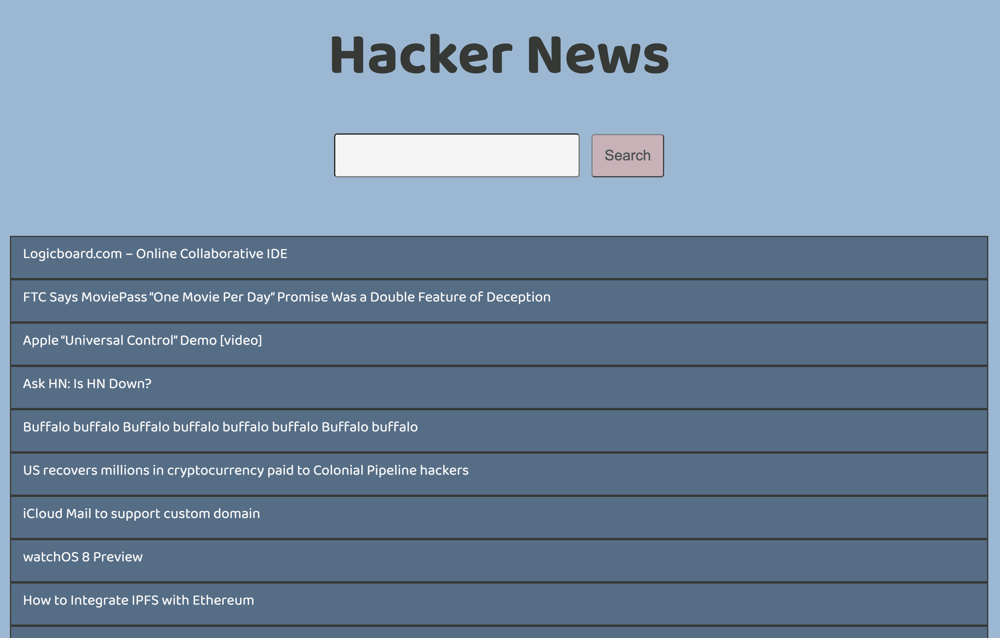

<h1 align="center">Welcome to my-app 👋</h1>

<p>
  <a href="https://www.npmjs.com/package/my-app" target="_blank">
    
  </a>
  <a href="#" target="_blank">
    
  </a>
  <a href="https://twitter.com/duffManCode" target="_blank">
    
  </a>
</p>

> React App that fetches the latest articles from Hacker News API.  You can also search for articles.

### 🏠 [Homepage](https://main.d3bzl8aythybe1.amplifyapp.com/)

### ✨ [Demo](https://main.d3bzl8aythybe1.amplifyapp.com/)

## Install

```sh
npm install
```

## Usage

```sh
npm run start
```

## Run tests

```sh
npm run test
```

## Author

👤 **Brendan Duffy**

* Website: www.devduffy.com
* Twitter: [@duffManCode](https://twitter.com/duffManCode)
* Github: [@thewalkingduff](https://github.com/thewalkingduff)
* LinkedIn: [@devduffy](https://linkedin.com/in/devduffy)

## Show your support

Give a ⭐️ if this project helped you!

***
_This README was generated with ❤️ by [readme-md-generator](https://github.com/kefranabg/readme-md-generator)_